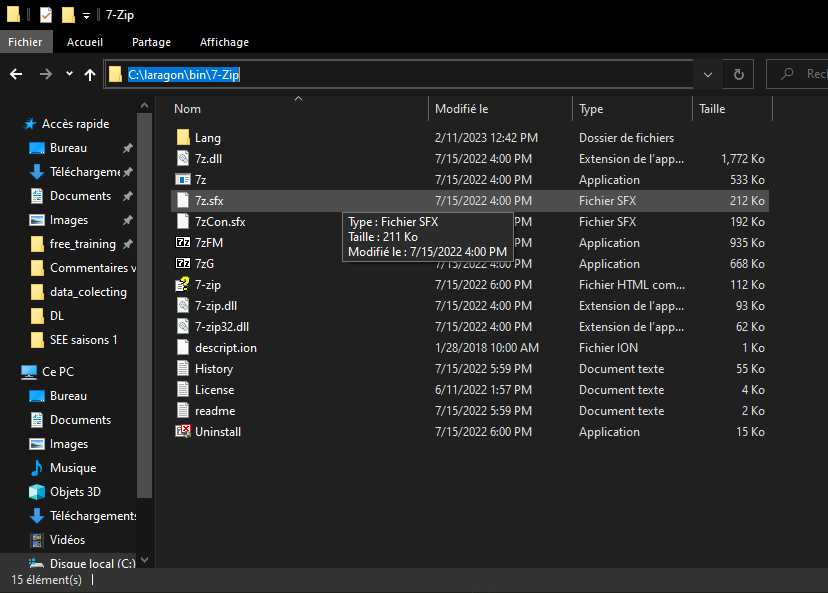
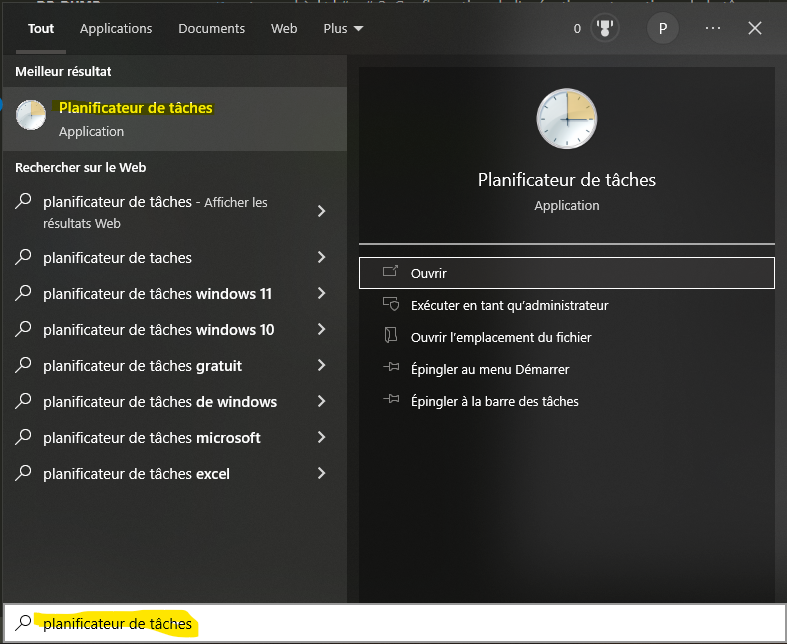
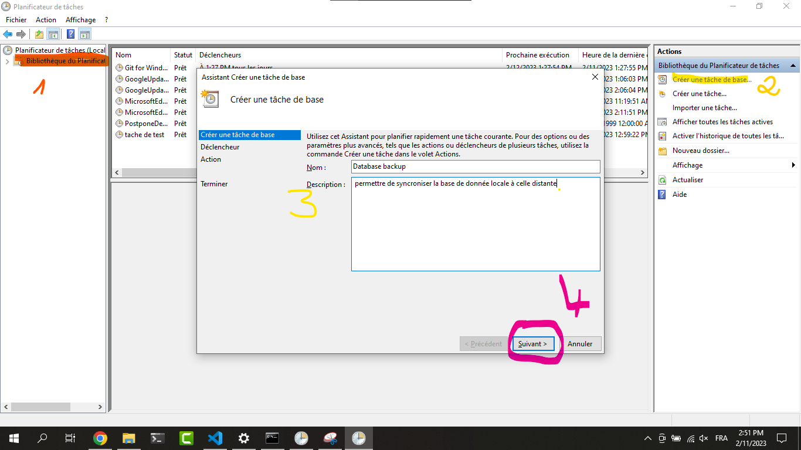
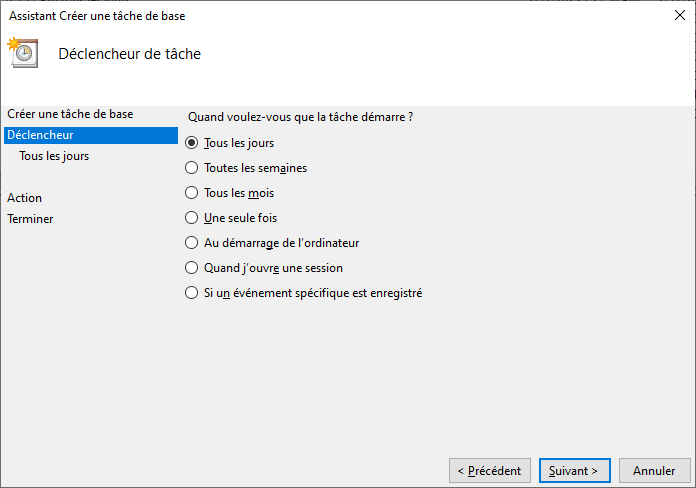
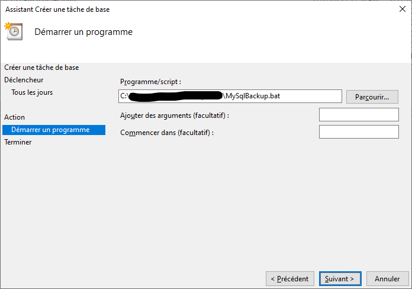
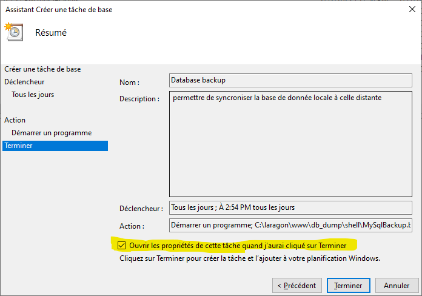
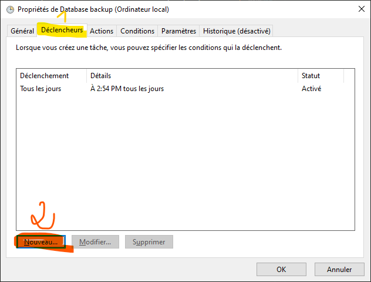
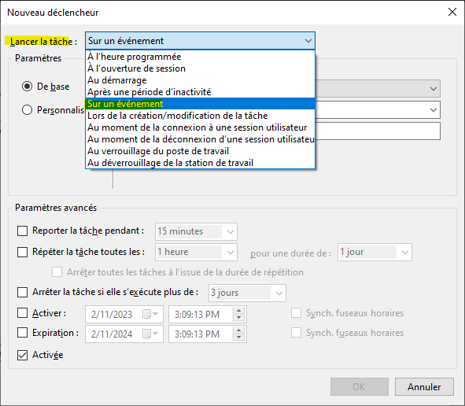
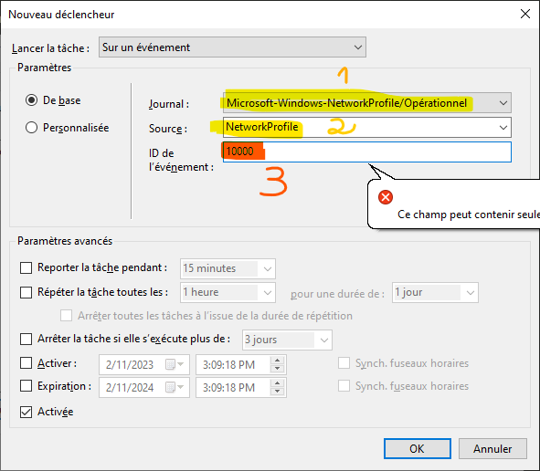

Guide d'installation du module de replication de la base de donnée
====
L'installation sur le serveur local (chez le client) se fait en deux phases apres l'installation du serveur (laragn et outils):
- l'ajout du fichier `./shell` et de son contenu au elements de laragon
- La configuration de la tache de replication sur le systeme (Windows task scheduler) pour que le script s'execute à chaque fois que l'ordinateur se connecte à internet.
----
># I.  Installation du script shell
>- *copier* le fichier *`MySqlBackup.bat`* contenu dans le dossier _./serveur local_ et *collez* le dans un repertoire sur le serveur local
>- Modifier les valeurs de quelques variables à l'interieur en l'occurence les variables _*`server`*_ (changer le sous domaine distant pour qu'il corresponde à celui attribué au serveur local); et la variable _*`db`*_ qui correspondra au nom de la base de donnée (les noms en local et distants doivent etre identiques)
>- Copier le dossier `./7-zip` contenu dans le dossier `./shell` et le coller dans le dossier bin du dossier `./laragon` il devra être dans le repertoire `C:/laragon/bin`.

-------------
># 2. Configuration de l'exécution automatique de la tâche

>Pour l'execution automatique de la tache lorsqu'on connecte l'ordinateur à internet, il faut ouvrir l'outils de gestion des taches sous windows 

>
-----
>ouvrez la bibliotheque de taches puis creer une nouvelle tache de base en lui donnant un nom et une description 
-----
>Pour ce qui est du declencheur vous pouvez le laisser comme tel et mettre juste _Tout les jours_ .
-----
>Pour les actions demarrer un programme puis choisir comme programme le fichier `./MySqlBackup.bat` que vous avez copié sur le serveur local 
----
>ceci fait, dans la page de confirmation, cochez l'option _ouvrir les propriétés_ de la tache avant de cliquer sur terminer 
------
>Une fois la tache créée, ses propriétés s'ouvrent aussi tôt, aller sur l'onglet `Déclencheur` et cliquez sur `Nouveau`

-----
> Dans la fenetre qui s'ouvre choisissez comme valeur pour _Lancer la tâche_ : `Sur un evenement` 
-----
> Une fois que ceci est fait, vous devez juste choisir comme _Sournal_ : `_Microsoft-Windows-NetWorkProfile/Opérationnel_` en prenant pour _Source_ `_NetworkProfile_` et pour _ID d'evenement_ `10000`. 
-----
> Ensuite validez tout et enregistrez la tache puis testez le tout en connectant l'ordinateur à internet. Un interface de ligne de commande devrait s'ouvrir pour executer le script shell que vous avez prealablement copié sur le serveur
